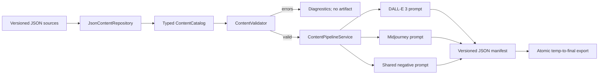

# Original Content Pipeline

The content pipeline turns authored gameplay species and art briefs into deterministic, provider-ready sprite prompts. It does not call an external image service. This keeps validation, source control, review, and prompt generation reproducible while leaving image generation credentials and usage outside the game runtime.

## Five-creature roster

| Creature | Elements | Wildlife foundation | Transformed folklore direction | Readable signature |
| --- | --- | --- | --- | --- |
| Cindermite | Ember / Stone | Mole cricket, armadillo girdled lizard | Fire-salamander and forge-spirit tales | Furnace shell, shovel claws, asymmetric basalt plate |
| Reedling | Tide / Grove | Water deer, reedbuck, leafy seadragon | Benevolent marsh guardian and water-diviner tales | Reed antlers, suspended droplets, leaf fins |
| Gustlet | Gale | Sugar glider, kestrel, feather-tailed possum | Wind messenger and mountain omen tales | Triangular membrane, compass chest patch, forked tail vane |
| Aurorook | Tide / Gale | Arctic tern, flying fish, ribbon eel | Polar sky lantern and sea-voyager omen tales | Crescent wings, eye mask, luminous tail ribbons |
| Cairnback | Stone / Grove | Pangolin, wombat, lichen-covered tortoise | Cairn guardian and walking-hill tales | Stair-stepped plates, moss eyebrow, flowering shoulder sprig |

All names, anatomy, silhouettes, palettes, and signature features are original to Pokedot. Folklore and wildlife are treated as broad source material rather than copied characters. The validator also rejects a small denylist of obvious third-party franchise references; human art review remains required.

## Source files

- `data/species.json` owns gameplay identity, stats, elements, XP, capture rate, and learnsets.
- `data/creature_concepts.json` owns silhouette, anatomy, materials, personality, scale, palette, inspirations, pose, and concept-specific exclusions.
- `data/art_directions.json` owns shared 96×96 sprite constraints, camera, lighting, composition, negative terms, and Midjourney parameters.
- `data/schemas/creature_concepts.schema.json` and `data/schemas/art_directions.schema.json` define the authoring contracts.
- `data/schemas/prompt_manifest.schema.json` defines the generated artifact contract.

Concept IDs intentionally match species IDs. A concept references one art direction and repeats only elemental IDs so validation can detect visual/gameplay drift. Every gameplay species must have exactly one valid concept.

## Compilation flow



`ContentPipelineService` sorts concepts lexically by stable ID. It combines the same subject and production contract for both providers, then adds provider-specific framing. There are no timestamps or random values, so unchanged inputs produce byte-equivalent prompt content.

The DALL-E 3 field is a complete natural-language instruction. The Midjourney field contains the same design contract plus shared `--no` exclusions and the art direction's parameters. Both specify one centered, transparent-background, three-quarter sprite with restricted colors and features readable at native resolution.

## Generate the manifest

From the repository root:

```powershell
godot --headless --path . --script res://tools/export_content_pipeline.gd
```

The default output is ignored build material at `builds/content/creature_sprite_prompts.json`. Override it with a project or user path:

```powershell
godot --headless --path . --script res://tools/export_content_pipeline.gd -- --output=user://creature_sprite_prompts.json
```

The command exits non-zero when loading, cross-reference validation, compilation, or export fails. `PromptManifestRepository` writes a temporary file, protects an existing artifact with a backup during promotion, and removes temporary/backup files after success.

## Validation and diagnostics

The pipeline blocks output for:

- unknown species, types, or art directions;
- concept/species ID or ordered elemental-type mismatch;
- gameplay species without an art concept, or two concepts targeting one species;
- empty inspiration, anatomy, material, pose, composition, or exclusion fields;
- fewer than two signature features;
- invalid palette colors or sprite canvas bounds;
- obvious third-party franchise terms in authored art text.

Diagnostics use the existing `ValidationIssue` contract with stable codes and source paths. Presentation code and external authoring tools can observe or format these results without coupling to JSON parsing.

## Adding a creature

1. Add the gameplay species and any moves using stable lowercase `snake_case` IDs.
2. Add the species to at least one encounter table if it should be obtainable in the current vertical slice.
3. Add a matching concept with distinct wildlife, transformed folklore, silhouette, palette, pose, and exclusions.
4. Run the exporter and review both provider prompts at 96×96 output size.
5. Run the full headless test suite before committing either source or generated assets.

Changing shared visual direction should create a new art-direction ID or increment `prompt_version`. This preserves the provenance of previously generated sprites and makes deliberate regeneration visible in manifests.
